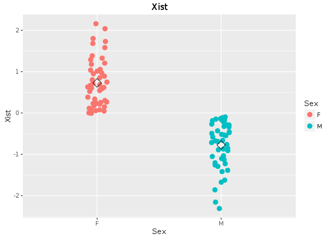
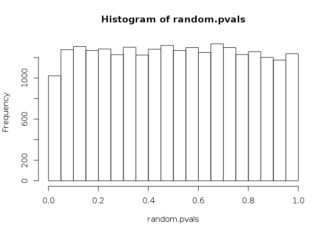
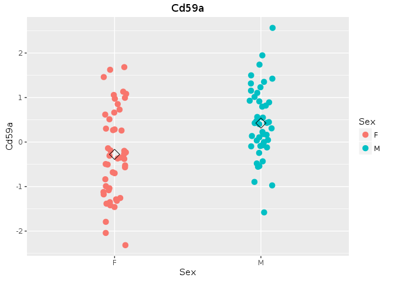

RNA-seq Differential Expression Analysis
================

-   [Intro](#intro)
-   [Ggplot](#ggplot)
-   [T-test](#t-test)
-   [Adjust P-values for Multiple Comparisons](#adjust-p-values-for-multiple-comparisons)
-   [DESeq2 Package](#deseq2-package)

Intro
-----

One of the most common applications of RNA-seq technology is using it for identifying genes that are deferentially expressed between sample groups, for example, wild type vs mutant, or cancer vs normal samples.

We will be using Diversity Outbred liver dataset: 192 mice, males vs. females, high fat (HF) diet vs. chow diet.

``` r
# load dataset
load("/data/Rdata/DO192_DataforSysGenCourse.Rdata")
```

For the beginning, let us restrict ourselves to HF mice data.

``` r
hf.rna <- subset(expr.rna.192, covariates.rna.192$Diet == "HF")
hf.protein <- subset(expr.protein.192, covariates.protein.192$Diet == "HF")
hf.annot <- covariates.rna.192[covariates.rna.192$Diet == "HF",]
```

For a given gene, how would you compare expression between males and females?

Ggplot
------

Let us make a plot.

``` r
# load library
library(ggplot2)

# find the gene
gene.symbol = "Xist"
index.rna = which(annotations.rna.192$Gene == gene.symbol)
dt = data.frame(hf.annot, expr = hf.rna[, index.rna])

# we want Sex on x-axis, expr on y-axis and color by Sex
p <- ggplot(dt, aes(x=Sex, y=expr, colour = Sex))
# make a dot for every point, jitter a bit to avoid overplotting
p <- p + geom_point(position = position_jitter(width = 0.2), size=3)
# plot a mean for each group
p <- p + stat_summary(fun.y=mean, geom="point", shape=5, size=4, color="black")
# add y-label and title
p <- p + ylab(gene.symbol) + ggtitle(gene.symbol)
p
```



#### Exercise 1

-   Instead of Xist, try your favorite gene. Try to guess whether there is a difference between males and females.
-   *Optional*: Instead of RNA expression, try to make the same graph for protein expression (note: XIST protein is not expressed, you must try another gene)

T-test
------

``` r
# find the gene
gene.symbol = "Xist"
index.rna = which(annotations.rna.192$Gene == gene.symbol)
t.test(hf.rna[, index.rna] ~ hf.annot$Sex)
```

    ## 
    ##  Welch Two Sample t-test
    ## 
    ## data:  hf.rna[, index.rna] by hf.annot$Sex
    ## t = 12.813, df = 91.923, p-value < 2.2e-16
    ## alternative hypothesis: true difference in means is not equal to 0
    ## 95 percent confidence interval:
    ##  1.271178 1.737545
    ## sample estimates:
    ## mean in group F mean in group M 
    ##       0.7273916      -0.7769701

``` r
pval <- t.test(hf.rna[, index.rna] ~ hf.annot$Sex)$p.value
```

#### Exercise 2

-   Try to run T-test on your favorite gene from Exercise 1. Did you guess correctly?
-   Optional: Try to find a gene where it is hard to guess whether the sex effect is significant. What do you get from T-test?

How would you run T-test for every gene?

``` r
# how many genes do you want to run
N <- 100
# create a vector of p-values
pvals <- rep(NA, N)

# for every gene, run T-test and save the p-value
for (index.rna in 1:N) {
  pvals[index.rna] <- t.test(hf.rna[, index.rna] ~ hf.annot$Sex)$p.value
}  
```

You can speed up the computation with `rowttests` function from `genefilter` package.

``` r
library(genefilter)

# fast T-test for every column
pvals <- colttests(hf.rna, factor(hf.annot$Sex))$p.value
```

So, do we see sex effects in RNA expression data?

    table(pvals < 0.05)
    hist(pvals)

Adjust P-values for Multiple Comparisons
----------------------------------------

Let us make a mess and randomly shuffle rows.

``` r
set.seed(1234)
random.rna <- hf.rna[sample(nrow(hf.rna)),]
random.pvals <- colttests(random.rna, factor(hf.annot$Sex))$p.value
```

Because of random shuffling there should be no sex effect. However, we still get hundreds of p-values below `0.05` just by random chance.

``` r
summary(random.pvals < 0.05)
```

    ##    Mode   FALSE    TRUE    NA's 
    ## logical   24028    1022       0

``` r
hist(random.pvals)
```



#### Exercise 3

-   Make a plot for one of significant genes. Is it believable?

``` r
# find the gene
index.rna = 8568
gene.symbol = annotations.rna.192$Gene[index.rna]

dt = data.frame(hf.annot, expr = random.rna[, index.rna])

# we want Sex on x-axis, expr on y-axis and color by Sex
p <- ggplot(dt, aes(x=Sex, y=expr, colour = Sex))
# make a dot for every point, jitter a bit to avoid overplotting
p <- p + geom_point(position = position_jitter(width = 0.2), size=3)
# plot a mean for each group
p <- p + stat_summary(fun.y=mean, geom="point", shape=5, size=4, color="black")
# add y-label and title
p <- p + ylab(gene.symbol) + ggtitle(gene.symbol)
p
```



``` r
random.pvals[index.rna]
```

    ## [1] 0.0003124018

We need to adjust p-values for multiple comparisons. There are many methods to do so. We will try Benjamini & Hochberg method implemented in `p.adjust` function.

``` r
adj.random.pvals <- p.adjust(random.pvals, method="BH")
summary(adj.random.pvals < 0.05)
```

    ##    Mode   FALSE    NA's 
    ## logical   25050       0

``` r
adj.pvals <- p.adjust(pvals, method="BH")
summary(adj.pvals < 0.05)
```

    ##    Mode   FALSE    TRUE    NA's 
    ## logical   17266    7784       0

DESeq2 Package
--------------

With low number of samples per group, the estimate of variance is not accurate. The solution is share information across the genes, i.e. Bayesian shrinkage.

For **DESeq2** we will need be using read counts at RNA level.

``` r
rna.counts = read.table("/data/emase/expected_read_counts_gene_level.txt", header=T,
                        row.names=1)
```

Let us take just 3 males and 3 females on chow diet

``` r
small.counts <- rna.counts[,c(1:3, 101:103)]
```

And apply DESeq2 package as follows:

    library(DESeq2)
    colData <- DataFrame(group = factor(c(rep("F",3), rep("M", 3))))
    dds <- DESeqDataSetFromMatrix(countData = as.data.frame(round(small.counts)),
             colData = colData, design = ~ group)
    dds <- DESeq(dds)
    res = results(dds)
    summary(res)
    hist(res$pvalue)
    summary(res$padj < 0.05)
    plotMA(res, main="M-A Plot: 3 Samples per group", ylim=c(-2,2))

Let us look for the most significant gene

    d<- plotCounts(dds, gene=which.min(res$padj), intgroup="group",
                  returnData=TRUE)
    d              
    rownames(small.counts)[which.min(res$padj)]

    p <- ggplot(d, aes(x=group, y=count, color=group)) +
      geom_point(position=position_jitter(w=0.2,h=0),size=3)
    p
